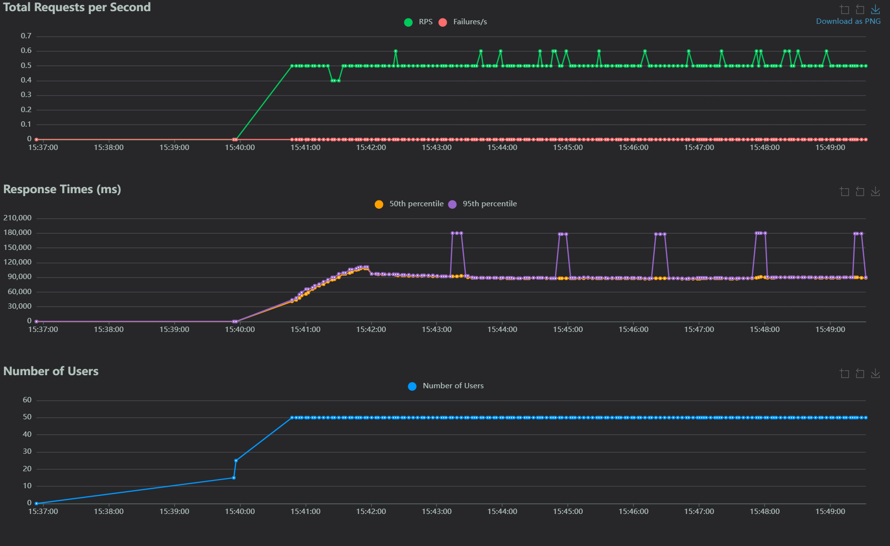

# Skin Cancer Classifier

## Project Description
The **Skin Cancer Classifier** is a machine learning application designed to classify skin lesion images as **benign** or **malignant** using a pre-trained MobileNetV2 model. Built with **Streamlit**, a Python framework for creating interactive web apps, this project provides a user-friendly interface with three main tabs:
- **Prediction**: Upload a skin lesion image (JPG, JPEG, or PNG) to predict whether it’s benign or malignant, with confidence scores.
- **Retraining**: Upload new images to retrain the model, enhancing its accuracy with additional data.
- **Data Insights**: Visualize dataset statistics, including class distribution, image dimensions, and pixel intensity distributions.

The app is ideal for researchers, students, or medical professionals exploring AI-driven skin cancer detection. It uses TensorFlow for model training and prediction, and pandas/matplotlib for data visualization. The project is structured for local development and can be deployed on platforms like Render for web access.

### 📊 Model Performance

The skin cancer classification model was evaluated using a held-out test set, and it achieved the following metrics:

| Metric        | Value   | Description |
|---------------|---------|-------------|
| **Test Loss** | `0.2276` | Measures how well the model's predictions align with actual labels. Lower values indicate better performance. |
| **Accuracy**  | `89.29%` | The percentage of correct predictions made by the model. |
| **Precision** | `89.29%` | Indicates how many of the positively predicted cases were actually positive (low false positives). |
| **Recall**    | `89.29%` | Indicates how many actual positive cases were correctly identified (low false negatives). |

#### ✅ Interpretation

These results show that the model performs reliably in distinguishing between benign and malignant skin lesions. High precision and recall are especially important in medical diagnosis tasks, and an accuracy close to 90% demonstrates the model’s practical viability.

## Video Demo
A demonstration of the Skin Cancer Classifier is available on YouTube:  
[Watch the Video Demo](https://www.loom.com/share/0b092164d7704f63bbcaacc60e189d71?sid=b23a14dc-cc08-4e0c-bdf5-da3a474a2eae)  
*Note*: This is a placeholder link. Update with the actual YouTube link once the demo is uploaded.

## Deployed URL
The app is deployed at:  
[Skin Cancer Classifier App](https://summative-ml-pipeline.onrender.com/)  
Ensure the app is running on Render before accessing. If the app is suspended (due to Render’s free tier), it may take a moment to spin up.

## Setup Instructions
Follow these steps to set up and run the Skin Cancer Classifier locally on a Windows machine. These instructions assume you have basic familiarity with the command line and Python.

### Prerequisites
- **Python 3.8 or higher**: Download and install from [python.org](https://www.python.org/downloads/).
- **pip**: Python’s package manager, included with Python.
- **Git**: For cloning the repository (optional). Download from [git-scm.com](https://git-scm.com/downloads).
- A code editor like VS Code (optional but recommended).

### Step-by-Step Setup
1. **Clone or Download the Repository**
   - If using Git:
     ```bash
     git clone https://github.com/your-username/summative-ml-pipeline.git
     cd Summative - ML Pipeline
     ```
   - Alternatively, download the project as a ZIP from GitHub and extract it to `C:\Users\TestSolutions\Desktop\Summative - ML Pipeline`.

2. **Verify Project Structure**
   - Ensure the following directories and files exist:
     ```
     Summative - ML Pipeline/
     ├── src/
     │   ├── __init__.py
     │   ├── app.py
     │   ├── model.py
     │   ├── utils.py
     │   ├── insights.py
     │   ├── prediction.py
     │   ├── preprocessing.py
     ├── data/
     │   ├── train/
     │   │   ├── benign/  # Contains .jpg images
     │   │   ├── malignant/  # Contains .jpg images
     │   ├── test/
     │   │   ├── benign/  # Contains .jpg images
     │   │   ├── malignant/  # Contains .jpg images
     ├── models/
     │   ├── skin_cancer_class.keras  # Optional; created during retraining
     ├── requirements.txt
     ├── sample.jpg
     ```
   - Run in Command Prompt to verify:
     ```bash
     dir C:\Users\TestSolutions\Desktop\Summative - ML Pipeline\data\train
     dir C:\Users\TestSolutions\Desktop\Summative - ML Pipeline\data\test
     dir C:\Users\TestSolutions\Desktop\Summative - ML Pipeline\models
     ```
   - Ensure `data/train/benign`, `data/train/malignant`, `data/test/benign`, and `data/test/malignant` contain `.jpg` images. If not, download a dataset (e.g., from Kaggle) and organize it accordingly.

3. **Set Up a Virtual Environment**
   - Create a virtual environment to isolate dependencies:
     ```bash
     cd C:\Users\TestSolutions\Desktop\Summative - ML Pipeline
     python -m venv venv
     ```
   - Activate the virtual environment:
     ```bash
     venv\Scripts\activate
     ```
   - You’ll see `(venv)` in your Command Prompt.

4. **Install Dependencies**
   - Install required packages from `requirements.txt`:
     ```bash
     pip install -r requirements.txt
     ```
   - Example `requirements.txt` content:
     ```
     streamlit==1.38.0
     tensorflow==2.17.0
     numpy==1.26.4
     pandas==2.2.2
     matplotlib==3.9.2
     seaborn==0.13.2
     pillow==10.4.0
     ```
   - If you don’t have a `requirements.txt`, create one with the above or install packages manually:
     ```bash
     pip install streamlit tensorflow numpy pandas matplotlib seaborn pillow
     ```

5. **Run the Streamlit App**
   - Start the Streamlit app:
     ```bash
     streamlit run src/app.py
     ```
   - Your default browser will open to `http://localhost:8501`, displaying the Skin Cancer Classifier interface.
   - If the browser doesn’t open, navigate to `http://localhost:8501` manually.

6. **Test the App**
   - **Prediction Tab**:
     - Upload a `.jpg`, `.jpeg`, or `.png` image (e.g., `sample.jpg`).
     - Click “Predict” to see the classification (benign/malignant) and confidence score.
   - **Retraining Tab**:
     - Upload images, select a class (`benign` or `malignant`), and click “Start Retraining”.
     - Images are saved to `data/new_uploads/<class>` and used to retrain the model.
     - If no model exists at `models/skin_cancer_class.keras`, a new one will be created.
   - **Data Insights Tab**:
     - View class distribution, image dimensions, and pixel intensity plots for `data/train` and `data/test`.
   - **Performance Insights**
     -
        ### 🧪 Load Testing Conclusion

        The Locust-based load test simulated up to **50 concurrent users** sending image prediction requests to the FastAPI model endpoint. The application successfully handled incoming traffic with **no major request failures**, maintaining a stable request throughput of around **0.5 requests per second**.

        However, the response time analysis revealed performance limitations:

        - ⏱️ **Median response times** increased steadily as user load grew.
        - 📈 **95th percentile spikes** indicate occasional bottlenecks, with some requests taking significantly longer than average.
        
        > **Conclusion**: The API is robust under light to moderate traffic, but would benefit from optimizations—such as asynchronous processing, model inference tuning, or horizontal scaling—to improve responsiveness and scalability under high load.


7. **Troubleshooting**
   - **ImportError**: Ensure `src/__init__.py` exists and you’re running `streamlit run src/app.py` from `C:\Users\TestSolutions\Desktop\Summative - ML Pipeline`.
   - **File Not Found Errors**:
     - Verify `data/train` and `data/test` contain `benign` and `malignant` subdirectories with `.jpg` images.
     - If `models/skin_cancer_class.keras` is missing, use the Retraining tab to generate it.
     - Check paths:
       ```bash
       dir C:\Users\TestSolutions\Desktop\Summative - ML Pipeline\data
       dir C:\Users\TestSolutions\Desktop\Summative - ML Pipeline\models
       ```
   - **Dependency Issues**: Ensure all packages are installed. Re-run `pip install -r requirements.txt`.
   - **Console Logs**: If errors occur, share the output from `streamlit run src/app.py` for debugging.

### Notes
- **Dataset**: If you don’t have a dataset, download one (e.g., ISIC Skin Cancer Dataset from Kaggle) and place images in `data/train/benign`, `data/train/malignant`, `data/test/benign`, and `data/test/malignant`.
- **Model**: The app uses a pre-trained MobileNetV2 model, saved as `models/skin_cancer_class.keras`. Retraining creates or updates this file.
- **Deployment**: The app is live at [https://summative-ml-pipeline.onrender.com/](https://summative-ml-pipeline.onrender.com/). For local changes, update paths to `/data` and `/models` in `app.py`, `model.py`, `prediction.py`, and `utils.py`, and adjust `render.yaml` to use `streamlit run src/app.py`.

For issues or contributions, contact [g.yhaan@alustudent.com] or open an issue on GitHub.